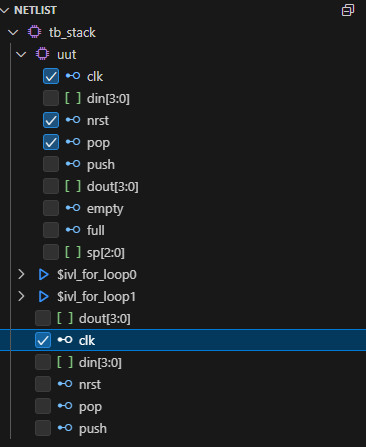

# Activities for Verilog Crash Course

## Module 110: Verification Exercise

On this exercise, we will no longer be using Jupyter notebooks to run code but we'd like to introduce you to the usual working environment for Verilog.
- First off, please run the repository by running the codespace from the **devcontainer**. Follow the instructions for it below.

### Run from devcontainer : Codespace

Press Code > Codespace and then choose Open in Codespace for this repository.

### Run from devcontainer : Local

Clone the repository locally 
Open the folder with VSCode
Command Palette > Open with DevContainer

## Familiarizing yourself with running Verilog code manually

The codespace will take about 10 minutes to setup. Once the codespace is open, you'll be met with a VSCode workspace complete with the tools we need.

Most of digital design (and coding, really) takes place in an integrated environment like VSCode. Observe portions of the workspace:
- **Terminal** at the bottom, where you can run commands like `ls`, `cd`, and `clear`.
- At the left is a **File Explorer**, with which you can inspect all of the files of the project.
- More buttons exist at the left, like the **Search** (magnifying glass), **Extensions** (blocks), and importantly, the **Waveform Viewer** (waveforms).

## First task: Running Verilog Simulations

Your first task is to run a simulation of the **stack** module implementation in `rtl/stack.v`. Do the following:

```bash
iverilog tb/tb_stack.v rtl/stack.v
./a.out
```

The output should show the following

```log
VCD info: dumpfile tb_stack.vcd opened for output.
Starting stack testbench...
Pushing  3
Pushing  7
Pushing 12
Pushing 15
Popped value: 15 (correct)
Popped value: 12 (correct)
Popped value:  7 (correct)
Popped value:  3 (correct)
tb_stack.v:73: $finish called at 202000 (1ps)
```

As discussed in the module, testbenches can generate waveforms when you add the following lines to them:

```
initial begin
    $dumpfile("tb_stack.vcd");
    $dumpvars(0, tb_stack);
end
```

The `tb/tb_stack.v` module already contains these lines and hence, a `tb_stack.vcd` file should be present in the main project folder. **Clicking the VCD file in the Explorer should open a waveform diagram tab**.

## Second task: Viewing Waveforms

Once the waveform diagram is open, you can click the **Waveform Viewer** in the sidebar. It's like an explorer for digital signals- clicking various "folders" (modules) and "files" (signals) allows you to see what they look like in the waveform viewer.



You can zoom into the waveform by pressing `CTRL` and then scrolling. You can shift the waveform horizontally by just scrolling.
Inspect the waveform diagram and answer the following questions. 
1. *At what time does the stack pointer `sp` reach 4?*
2. *For how many cycles is either `pop` or `push` asserted every transaction?*

## Third task: Writing your own testbench

Finally, it's time to write your own testbench. 
- Located in `rtl/queue.v` is a **queue** or **FIFO** written in Verilog.
- FIFO stands for *First In, First Out*. The first element enqueued is the first one dequeued.
- For example, enqueueing 3, 4, 6, 7 in order and then dequeueing all of them should still yield 3, 4, 6, 7 in order.
- When enqueue is 1, the 4b input in **din** is enqueued upon the next clock edge.
- When dequeue is 1, the 4b output **dout** will contain the dequeued element upon the next clock edge.
- The queue can only contain at most 4 elements. Trying to enqueuing more than 4 elements will not work, and so will dequeueing not work when the queue is empty.
- For example, enqueueing 3, 4, 6, 7, 8, and then dequeueing should yield 3, 4, 6, 7, 0, since 8 did not fit into the queue.
- Your task is to create the testbench in `tb/tb_queue.v`, confirm the proper operation of the queue, and inspect the waveform.

A sample waveform is shown below:


Answer the following questions:
1. Did you notice anything wrong with the queue? If so, what is wrong with the queue?
2. Can you fix what is wrong with the queue?